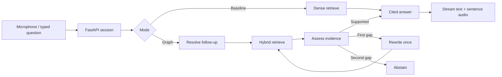

# LocalVoiceAI

A local-first voice RAG laboratory: ask questions about documents and web pages, compare baseline retrieval with a bounded LangGraph workflow, and inspect evidence, citations, timings, and benchmark results.

**Stack:** React / TypeScript / Vite, FastAPI, LangChain integrations, LangGraph, embedded Qdrant, SQLite, BGE embeddings, Ollama, faster-whisper, Silero VAD, and Kokoro.

## Windows quick start

Requirements: Python 3.11 or 3.12, Node.js 22.12+, [uv](https://docs.astral.sh/uv/getting-started/installation/), and [Ollama](https://ollama.com/download). The text/RAG app does not require Docker or a GPU. Speech and generation speed depend on your hardware.

Run in the project directory:

```powershell
Copy-Item .env.example .env
uv sync --locked --extra voice
ollama pull qwen3:4b
uv run --extra voice python scripts/warm_models.py --speech
cd frontend
npm ci
npm run build
cd ..
.\scripts\start.ps1
```

Open **http://127.0.0.1:8017**. Ollama must be running; `ollama serve` starts it if the desktop app is not already serving. Import the Aurora demo corpus in the knowledge library and wait for all four sources to show **ready**. Then ask, “When are readings uploaded, and when are they backed up?” Inspect citations and the graph. Change to Baseline RAG and ask the same question.

`uv.lock` and `frontend/package-lock.json` pin resolved dependencies. Python 3.12 is the development runtime; the package accepts 3.11–3.12. If uv cannot access its default cache, append `--cache-dir .uv-cache`. Without voice, use `uv sync --locked` and omit `--speech` when warming assets.

For development, start the backend using `scripts/start.ps1 -Dev`, then run `npm run dev` from `frontend` in a second terminal. Vite proxies HTTP and WebSocket API calls to port 8017.

## Configuration and model downloads

Copy `.env.example` and customize the `LVA_` settings. Never commit `.env`. Model downloads are explicit via the warm-up script or happen on first relevant use; models are not bundled into the repository. BGE and Whisper caches live under `data/models`; Hugging Face assets use `data/models/huggingface`. The manifest from warm-up records identifiers and a smoke-check result. Model repository revisions are cache-resolved, not immutable model snapshots; preserve your downloaded cache for reproducible inference.

- Local generation: `LVA_OLLAMA_MODEL=qwen3:4b` with configurable Ollama URL. No cloud fallback occurs automatically.
- Cloud generation: set `LVA_CLOUD_API_KEY`, `LVA_CLOUD_MODEL`, and optional `LVA_CLOUD_BASE_URL` for an OpenAI-compatible endpoint. Select **cloud** in the UI. Questions, relevant conversation history, and retrieved passages are sent to that provider. Keys remain on the server.
- Embeddings: `BAAI/bge-small-en-v1.5` through FastEmbed. Changing the embedding model requires a new `LVA_DATA_DIR` and reimport; indexes reject incompatible model settings.
- Speech: Whisper `base.en`, CPU INT8; Silero ONNX VAD; Kokoro `hexgrad/Kokoro-82M`, voice `af_heart`, CPU. The voice extra pins spaCy's English language model to 3.8.0. Keep network available during weight warm-up.
- Offline: warm all selected models first, then set `LVA_OFFLINE=true`. Cloud selection and web imports are disabled; local inference needs the assets already cached. Ollama model downloads are managed separately by Ollama. The frontend uses system fonts and has no third-party runtime asset requests.

Use one backend process (`--workers 1`); embedded Qdrant owns a local file lock. Serve on localhost only. This is a single-user app, not an authenticated public service.

## How it works



LangChain supplies model/embedding contracts, splitting, and Qdrant integration. LangGraph controls branches and checkpoints; each turn resets transient state and supplies persisted conversation history. Raw microphone audio is transient. SQLite stores generated text and separately acknowledged played sentences. Checkpoints are separate from the document index.

Ingestion supports UTF-8 TXT/Markdown, PDFs containing extractable text, and single public HTML/text pages. Pages and Markdown headings are preserved. Chunks target 600 tokens with 100-token overlap. Public URLs are validated at each redirect; connections pin a public resolved address and preserve hostname/SNI. Credentials, nonstandard ports, internal addresses, oversized pages, and unreadable pages are rejected. Scanned PDFs need external OCR.

New document vectors are written with a new version before SQLite switches the active version. Retrieval filters against active versions, so failed refreshes leave the old index usable. Cleanup of orphan vectors can be deferred safely; deleted sources are excluded immediately. Replace an uploaded file using its upload icon; refresh a URL to fetch current content. Source snapshots in historical citations may refer to a version subsequently removed: they remain as recorded evidence and are labeled with their original version.

Dense cosine scores and hybrid reciprocal-rank-fusion scores are different ranking signals, not calibrated confidence percentages. Evidence assessment uses the selected LLM. It is bounded to two retrieval attempts and fails closed when structured assessment is invalid. A generation with missing or invalid citations produces a visible warning; citation support still requires review. Retrieved content is untrusted data, and this app exposes no action-taking tools.

## Live voice and interruptions

Click the microphone, grant browser microphone permission, and wait for model loading. AudioWorklet resamples the device stream to mono 16 kHz, sending 512-sample PCM16 frames. Silero detects speech onset and a roughly 576 ms end silence. Utterances are capped at 30 seconds. Whisper transcribes complete utterances; this is live turn-taking, not incremental word-by-word transcription.

Kokoro synthesizes completed sentences while text generation continues. Speech onset cancels the active turn, clears pending audio, and invalidates old turn IDs. A lightweight browser energy trigger also stops queued playback promptly while server VAD confirms speech. Browser echo cancellation is enabled; headphones are recommended. Acknowledgments record **fully played sentences only**, so an interrupted sentence is not falsely marked heard.

Synchronous model kernels running in worker threads may finish their current computation after cancellation, but their results cannot be emitted to a cancelled turn. Full GPU/kernel preemption is not claimed. First-audio timing currently measures end-of-utterance detection to the first server audio event, not acoustic output at the speakers; browser/device buffering adds latency. Test the 300 ms interruption target on the actual microphone/speaker hardware before claiming it.

## Evaluation

The sample corpus describes a fictional Aurora research station. `sample_data/benchmark.json` contains 40 drafted reference cases: 10 direct, 8 paraphrase, 6 cross-document, 6 follow-up, and 10 unanswerable. References are supplied for human validation, not falsely labeled as previously human-reviewed.

Each evaluation runs both modes (80 answers). The UI reports source-level Recall@5 (expected source titles found among the top five passages), exact canonical abstention detection on the ten unanswerable cases, p50/p95 pipeline latency, and error counts in the saved JSON. The reference targets are ≥85% source recall and ≥90% abstention. A recall score here is **source coverage**, not passage-level annotated relevance. An alternate correct abstention phrasing may require manual review.

Review each answer against its reference and cited passages in the evaluation UI. Answer correctness and citation support stay null until a review is saved. Citation support is scored per reviewed answer containing citations. Runs retain raw answers, retrieved passages, operational traces, model/prompt/index metadata, and usage when available. Additional non-demo sources can affect retrieval; use a fresh data directory for a reproducible benchmark. No quality or latency target is assumed achieved before a real run.

## API and events

FastAPI's interactive schema is at `/docs`.

| Endpoint | Purpose |
|---|---|
| `GET /api/health`, `/api/models/status` | Configuration capabilities and Ollama availability |
| `GET /api/sources`, `/api/sources/{id}` | Indexing status, source details, and passages |
| `POST /api/sources/upload`, `/api/sources/url` | Queue ingestion |
| `POST /api/sources/{id}/refresh`, `/replace` | Refresh a page or replace a file |
| `DELETE /api/sources/{id}` | Remove source and indexed passages |
| `POST /api/demo/import` | Import the sample corpus |
| `POST /api/sessions`, `GET /api/sessions/{id}` | Session creation/history |
| `WS /api/ws/{session_id}` | Typed input, framed audio, streaming output, cancellation |
| `POST /api/evaluations`, `GET /api/evaluations` | Run/view benchmarks |
| `POST /api/evaluations/{id}/review` | Save human assessment |

WebSocket client JSON: `configure`, `text`, `voice_start`, `voice_stop`, `cancel`, `played`. `text` carries `text`, `mode` (`baseline`/`graph`), and `provider` (`local`/`cloud`). Binary frames contain 512 little-endian signed PCM16 samples. `played` carries server-issued `chunk_id` and `turn_id`.

Server JSON: `ready`, `turn_start`, `transcript`, `node`, `passages`, `answer_delta`, `citations`, `audio`, `turn_end`, `speech_start`, `cancelled`, `voice_loading`, `voice_ready`, `voice_stopped`, `warning`, `error`. Every event carries `session_id` and a nullable `turn_id`; ignore stale turn-scoped events. Audio events carry base64 WAV and chunk IDs. Only one active WebSocket per session is permitted.

## Checks

```powershell
uv run pytest -q
uv run ruff check backend tests scripts
cd frontend
npm run build
npm test
```

Automated tests use explicit model doubles for orchestration and deterministic embeddings for storage tests; they do not establish actual LLM quality. `scripts/warm_models.py` tests real model assets separately. The UI never substitutes test doubles for live models.

Known boundaries: single-user localhost; English speech; no OCR, crawler, action tools, hosted accounts, or cross-user permissions. The benchmark must be run with an available Ollama/cloud model and manually reviewed to substantiate quality claims.

## LM Studio local endpoint

Set these values in `.env` to use a model served by LM Studio:

```dotenv
LVA_LOCAL_BACKEND=lmstudio
LVA_LMSTUDIO_URL=http://localhost:1234/v1
LVA_LMSTUDIO_MODEL=qwen/qwen3-vl-4b
LVA_LMSTUDIO_API_KEY=
```

Start the LM Studio server and load the exact model identifier configured above.
Restart the backend after changing `.env`. The local provider uses LangChain's
OpenAI-compatible adapter and stays local, including in offline mode. Only loopback
LM Studio endpoints are accepted. The cloud provider remains separately selected.
If LM Studio authentication is enabled, set its token in the local `.env` file.
`/api/models/status` checks server reachability and the advertised model list;
an actual generation request is the stronger readiness check.

Keep the loaded context at least 8192 tokens for the initial RAG setup (16384 was
verified on this machine). Long histories can still exceed the configured context.
LM Studio serves generation only: document embeddings and Whisper/Kokoro remain
separate local services. The installed Nomic model is not substituted for BGE.
To return to Ollama, set `LVA_LOCAL_BACKEND=ollama`.

## Gemini API mode

Set `LVA_CLOUD_BACKEND=gemini`, `LVA_CLOUD_MODEL=gemini-flash-latest`, and
`LVA_CLOUD_API_KEY` in the gitignored server `.env`, then restart the backend.
Gemini uses the native LangChain Google adapter; `LVA_CLOUD_BASE_URL` applies only
to the OpenAI-compatible cloud adapter. Never put provider keys in Vite variables.

The header Local / API switch changes the active generation provider, palette,
artwork coloring, model label, and privacy details together. Local is the default
after reload. API mode sends questions, conversation context, and retrieved
passages to Google; speech and indexing remain local. Switching is locked during
an active answer or voice session. Stop that session before changing providers.
Local failures never silently send data to the cloud. Provider outages appear as
errors; configured credentials do not guarantee model availability.

### Bring your own API key

Open **API settings** below the provider card. Select Google Gemini, OpenAI,
Groq, or OpenRouter, enter the exact model ID available in your provider account,
and paste its key. Saving does not make an inference request or switch modes;
select **API** in the header when ready. Speech and indexing remain local.

UI-entered credentials are held only in this single-user server's memory, shared
across its browser tabs. They are not written to browser storage, app data, or
`.env`, and are never returned by the API. Restarting the server or choosing
**Remove my key & restore server settings** restores the startup configuration.
Provider changes are rejected during active voice, answers, playback, or evaluations.
This flow configures credentials; it does not validate account access or model availability.

The glass surface styling lives in `frontend/src/glass.css`: tinted translucent
cards, soft borders, pill controls, a native modal dialog, and opaque fallbacks
for missing backdrop-filter support or reduced-transparency preferences.

To verify downloaded model assets without contacting Hugging Face, run
`uv run python scripts/warm_models.py --speech --offline`. This check leaves your
normal API-mode configuration unchanged. Embedding and speech loaders prefer
their local caches; if assets are missing, online mode still needs download access.

API settings supports up to 20 named, memory-only connections. Add a provider and
model, edit a connection (leave the key blank to retain it), select Use, or remove
it. Selecting a connection does not turn on API mode or make a test request.
All profiles clear on server restart. Removing the active profile restores the
server's startup settings. Gemini inference behavior is unchanged.

The composer suggests up to three similar source names or related topics for
typed questions and completed voice transcripts. Matching uses local fuzzy title
matching and indexed-text keywords, not a confidence score or a claim of evidence.
Selecting a suggestion adds the chosen source to your draft; it never auto-sends.
